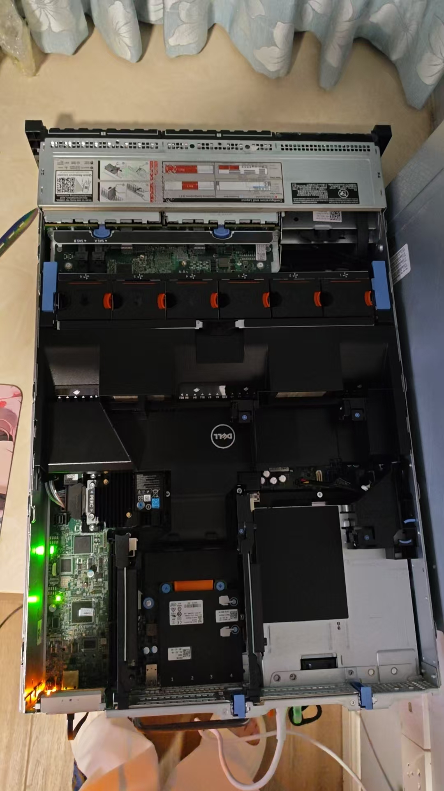
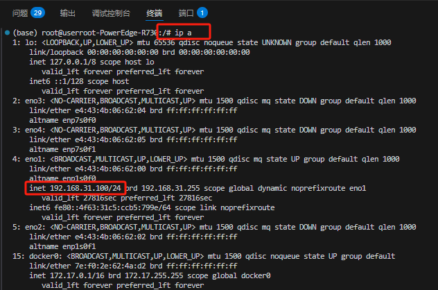
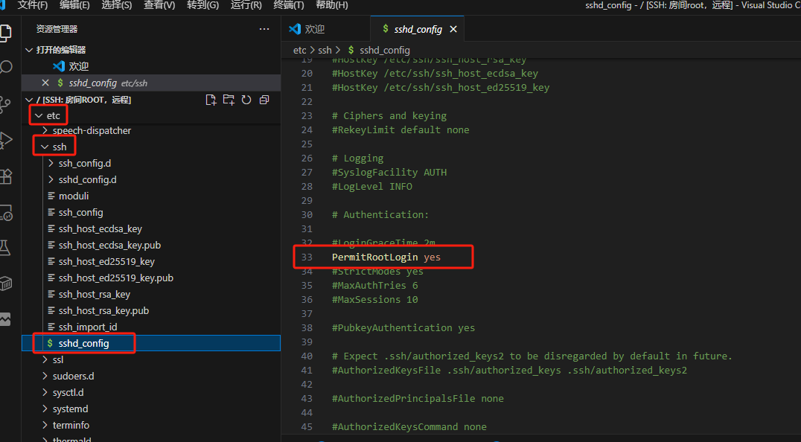
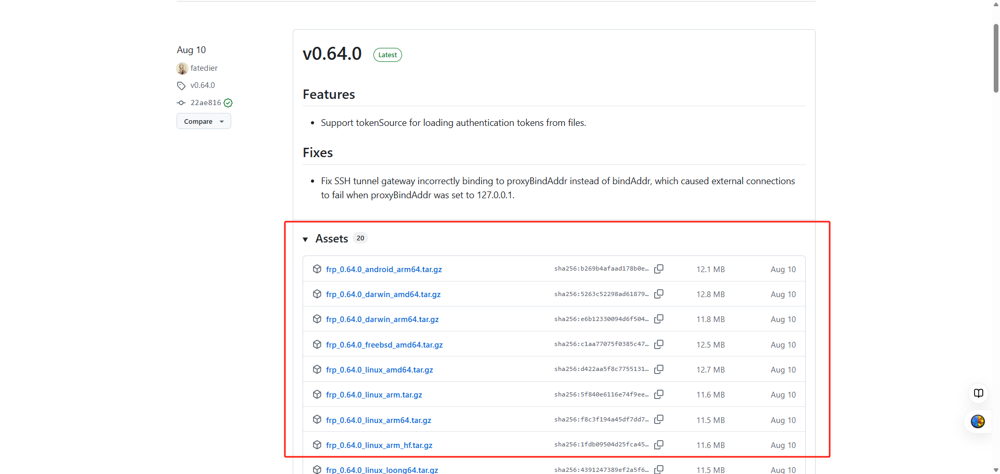
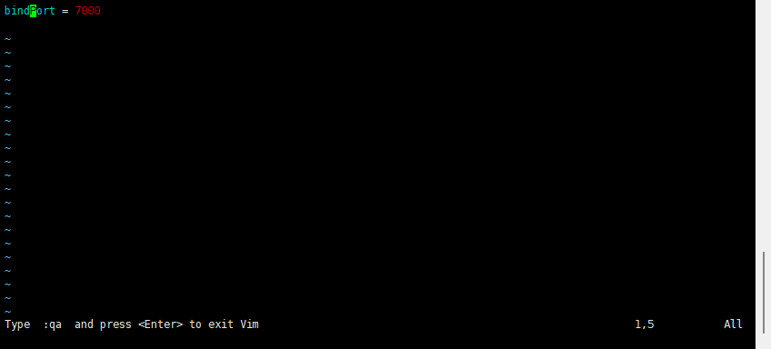
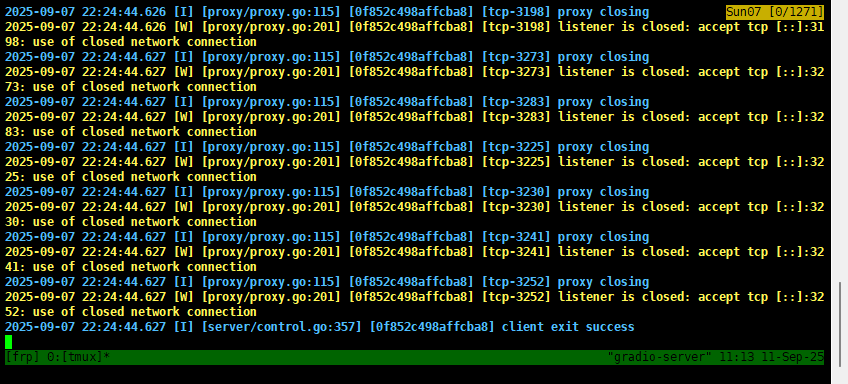
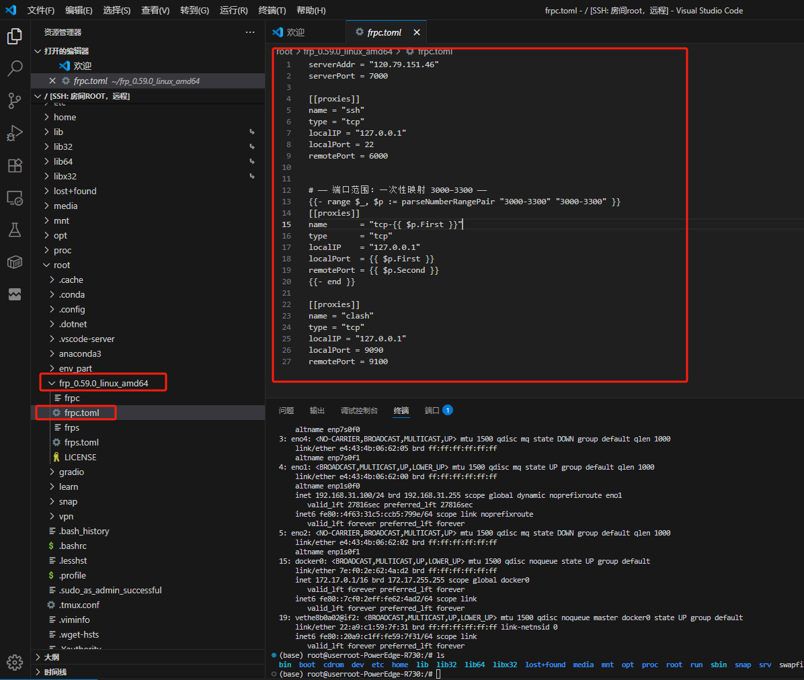
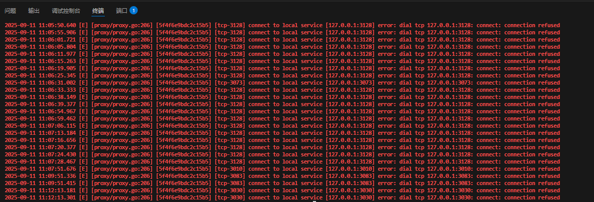

# 一、简要背景说明
&emsp;&emsp;俗话说得好，**工欲善其事必先利其器**，作为一个开发人员，没有好用的服务器，怎么瞎折腾？怎么开发呢？怎么成长呢？
&emsp;&emsp;但是大多数开发者过的都比较**拮据**，比如我自己，并且在实际中都会遇到一个问题：**公网 IP 不好弄**。即便能申请到公网 IP，价格通常也不便宜。比如百度云、阿里云、腾讯云等主流厂商的云主机虽然提供公网 IP，但长期**租用的成本很高**。


<p align="center">阿里云服务器价格</p>

&emsp;&emsp;该分享将介绍如何搭建一台属于自己的**线下高性能主机**，并将其配置成开发环境。整个方案适用于 Linux 系统，只需花费云主机 **约 1% 的价格**，就能获得媲美高性能云主机的开发体验。

教程的核心包括：

-   二手服务器/工作站的选购与安装
    
-   使用 **frp** 实现内网穿透
    
-   配置远程 SSH，让你随时随地访问本地主机.

&emsp;&emsp;只需要一点点动手能力，就能完成搭建！

&emsp;&emsp;需要注意的是，机架式服务器的风扇噪音可能比较大，建议将主机放在独立房间，或者使用隔音柜进行降噪处理，以免影响日常生活。

# 二、硬件选购
本次选用的机架式服务器为 **Dell PowerEdge R730**，配置如下：

-   **CPU**：双路 Intel Xeon E5-2680 v4（28 核 56 线程，总主频 2.4GHz，睿频可达 3.3GHz）
    
-   **内存**：2 × 16GB DDR4 ECC RDIMM，总计 32GB，可扩展
    
-   **硬盘**：16 × 600GB SAS 硬盘，组建 RAID5 阵列
    
-   **阵列卡**：Dell H730p，带 2GB 缓存，支持写入缓存加速
    
-   **电源**：750W 单电源

### 1. 服务器选型
R730 是2015 年左右发布的企业级机架式服务器，属于2015年 Dell 旗舰 13 代服务器。当年它的定位是大型企业的数据中心、虚拟化、数据库和高性能计算集群，所以售价非常高，一台全新、双路 CPU、满配内存和硬盘的 R730XD，**落地价往往是几万元**到十几万元人民币。而现在一台R730XD**只要200块**！对了，R730系列有很多，目前主流的有5款。
- R730（8个2.5寸硬盘）
- R730（16个2.5寸硬盘）
- R730（8个3.5寸硬盘）
- R730XD（24个2.5寸硬盘）
- R730XD（12个3.5寸硬盘）

    这里主要选取的是R730（16个2.5寸硬盘）
    主要区别在于：其一R730噪音较小，其二**R730支持两张大显卡**，后期有钱了可以买两张显卡，进行安装后变更牛逼的机器。

### 2. CPU选型
配置了 28 核 56 线程，**Xeon E5-2680 v4** 是 Intel 2014 年发布的处理器，主频是 2.4GHz，当年价格也是**几万块**，而现在！二手价格只要**几十块**！
### 3. 内存选型
先装两根16GB DDR4先装着，感觉内存不够再插就行了，毕竟有24条内存条插槽，根据实际情况自己加装。
### 4. 硬盘选型
16 × 600GB SAS 硬盘，组建 RAID5 阵列，**价格35块一个**，也是属于很便宜很便宜了，并且SAS硬盘的读取和写入速度在1800和1500MB/s左右，媲美一般的SSD，但是价格只有SSD的10%。
### 5. 阵列卡选型
Dell H730p，带 2GB 缓存，支持写入缓存加速，可以恢复，防止数据丢失。
### 6. 电源选型
750W 单电源，价格美丽，虽然说是750W，但是实际运行中，一般是200W功率，一天也就2度电，一度电五毛钱算的话，一天也就1块钱。后续如果加装显卡的话，750W电源可以直接再给显卡供电，不用再买多的电源。为什么买750W呢？因为这个电源是15年淘汰下来的，目前二手市场存货很多，价格相当便宜。

# 三、白嫖公网IP服务器

### 1. 白嫖300现金
公网IP怎么获取呢？当然是白嫖啊！！！
阿里云对**学生账户**直接送**300元**代金券（不需要满减，直接用的！）目前长期有效，链接如下
[白嫖300链接](https://www.aliyun.com/minisite/goods?userCode=5y0j5j5j)

<p align="center">白嫖现金卷</p>
没有学生资格的随便找个学生就行，大专，本科，硕士，博士都可以。

### 2. 白嫖低价服务器
领取了300代金券后， 进入下面链接，购买一个阿里云1年的服务器。这个服务器运气好可以用38买一年，买不到就用99买一年，都是优惠价，都带公网IP，缺点服务器差，装个Docker或者什么的服务器就炸了，但是不重要，我们只要公网IP，服务我们是运行在本地服务器上的!


<p align = "center">白嫖公网IP<p>
如果第一步没有学生资格的话，这里就自费38或者99一样的。
领取了300这里才用99，还剩了200块呢~可以买点其他的玩，比如可以买个域名，域名两年好像才99元。

# 四、安装服务器
## （一）本地 Ubuntu SSH 服务
首先要保证能在同一局域网下连接到本地SSH服务器，然后再考虑内网穿透的事情。

<p align = "center">Ubuntu ssh执行<p>


### 1. Ubuntu 上要安装并启动 SSH 服务

默认以root用户执行，就不输入sudo了哈~
```bash
apt update # 更新apt
apt install openssh-server -y # 下载ssh
systemctl enable ssh # 将 SSH 服务设置为​​开机自动启动​
systemctl start ssh # 立即启动​​ SSH 服务
```
检查是否正常运行：
```
sudo systemctl status ssh
```
如果看到``` active (running) ```就说明 SSH 服务已启动。

### 2. 查看 Ubuntu 的 IP 地址
```bash
ip a
```
查看inet后面的东西就是ip地址。我这里是192.168.31.100

<p align = "center">Ubuntu 本地IP地址<p>

### 3. root用户直接连接
众所周知，ssh为了保护用户，同时也为了保护ssh自己，ssh连接默认**禁止root用户直连**，但是我们要瞎搞，root用户是最方便瞎搞的。所以我们要修改ssh的配置文件，让我们可以直连。

#### 3.1 编辑 SSH 配置文件：
```bash
/etc/ssh/sshd_config # SSH文件默认路径
```
找到这一行：
```bash
PermitRootLogin prohibit-password
```
改成：（用nano或者vim或者txt都可以编辑）
```bash
PermitRootLogin yes
```

<p align = "center">修改后的<p>

#### 3.2 重启 SSH 服务：
```bash
sudo systemctl restart ssh
```
这样就可以直接登录 root 账号了
### 4. 测试SSH连接
可以用笔记本，在同一网络环境下，用win系统自带PowerShell/命令行：
```bash
ssh 用户名@192.168.1.120
```
输入密码后，如果能成功进入 Ubuntu 终端，就可以开启内网穿透服务了


## （二）frp 内网穿透
### 1. [frp](https://github.com/fatedier/frp)说明：
frp 是一个反向代理软件，用于将本地服务器的端口映射到公网 IP 上，从而实现内网穿透。作者也是中国人，有[中文文档支持](https://gofrp.org/zh-cn/docs/)。

一般来说远程操作用的都是用的SSH协议，连接格式一般是：
HostName xxx.xxx.xxx.xxx
Port 22
User xxx
SSH协议的端口号普遍来说都是22，我们只需要让frp将本地22端口映射到公网IP的某一个端口即可，这里我选用6000端口。
### 2. frp两部分说明
安装frp主要分为两个大的步骤，因为frp分为两部分；
- 第一部分frpc（最后的字母c代表client）是客户端
- 第二部分frps（最后的字母s代表server）是服务端

frpc和frps的安装方式基本一样，都是通过wget安装，或者去[官网](https://github.com/fatedier/frp/releases)下载最新的包，然后通过物理或者互联网传输安装。
需要注意的是，arm和amd的区别。
- arm = 英特尔的CPU，x86架构
- amd = AMD公司的CPU

请根据硬件选择对应的安装包，不然装不上

<p align = "center">官方包<p>

#### 2.1 阿里云服务器配置（服务端 frps）
修改配置文件会用到toml语法，toml语法和python高度相似，很简单，大可以看一下，看一眼就会，toml的[官方中文文档](https://toml.io/cn/v1.0.0?utm_source=chatgpt.com)已经准备好了。
##### 2.1.1 下载 FRP
怎么连接上阿里云服务器的教程就不写了，这个应该大家都会。
```bash
wget https://github.com/fatedier/frp/releases/download/v0.59.0/frp_0.59.0_linux_amd64.tar.gz # 下载压缩包
tar -zxvf frp_0.59.0_linux_amd64.tar.gz # 解压缩包
cd frp_0.59.0_linux_amd64 # 进去
```

##### 2.1.2 配置 frps
(1) 用vim打开**frps.toml**文件，写入信息
```bash
bindPort = 7000
```


(2) 启动frps
```bash
./frps -c ./frps.toml
```


#### 2.2 本地服务器配置（客户端 frpc）
##### 2.2.1 下载 FRP（跟上面一样版本，保持一致）。
```bash
wget https://github.com/fatedier/frp/releases/download/v0.59.0/frp_0.59.0_linux_amd64.tar.gz
tar -zxvf frp_0.59.0_linux_amd64.tar.gz
cd frp_0.59.0_linux_amd64
```

##### 2.2.2 配置 frpc
(1) 用vim打开**frpc.toml**文件，写入信息
```bash
serverAddr = "xxx.xxx.xxx.xxx" # 写阿里云的公网IP
serverPort = 7000 # 这个端口专门用来运行的是fpr进程

# 端口映射的一个配置
[[proxies]] 
name = "ssh"
type = "tcp"
localIP = "127.0.0.1"
localPort = 22 # 本地22端口
remotePort = 6000 # 映射到公网的6000端口


# —— 端口范围：一次性映射 3000–3300 —— 
{{- range $_, $p := parseNumberRangePair "3000-3300" "3000-3300" }}
[[proxies]]
name       = "tcp-{{ $p.First }}"
type       = "tcp"
localIP    = "127.0.0.1"
localPort  = {{ $p.First }}
remotePort = {{ $p.Second }}
{{- end }}
```


(2) 启动frpc
```bash
./frpc -c ./frpc.toml
```
显示下面一堆红不重要，因为映射了3000到3300的端口，一共是301个端口，但是目前这些端口还没装服务，所以报错，之后装了服务后就不会报错了，也不影响实用。


（3）测试
```bash
ssh user@阿里云IP -p 6000
```
就会被转发到家里的服务器 22 端口。

## （三）设置为自启
为避免frp因异常情况崩溃后导致ssh无法连接，需修改配置文件，使服务每次断开后自启
### 1. systemd介绍
systemd介绍：
systemd.unit是所有 Systemd 单元文件的“总纲领”和“[通用说明书](https://www.jinbuguo.com/systemd/systemd.index.html)”。​

在现代的 Ubuntu (16.04 以后)，systemd 是默认的服务管理工具。它的好处是：
- 自动重启：服务崩溃或退出后，systemd 会按照配置自动拉起。
- 开机自启：配置好后，服务器重启也会自动启动 frpc。
- 日志集中管理：日志会记录到 journalctl，方便排查问题。
- 资源管理：可以限制 CPU、内存使用，还能方便地停止、重启、查看状态。

### 2. 创建自启文件
创建 /etc/systemd/system/frpc.service
备注：
- /etc/systemd/system/ 是管理员自定义服务文件的目录。
- /lib/systemd/system/ 是系统自带的服务。

所以，放在/etc/systemd/system。

写入内容
```bash
# /etc/systemd/system/frpc.service
# 系统级别 的 service 文件注释不能写在尾行，只能在新的一行加上注释
# =======================================
# frpc.service - FRPC 客户端 systemd 配置
# =======================================

[Unit]
# 服务描述
Description=FRPC Client
# 确保网络启动后再启动 frpc
After=network.target

[Service]
# 服务类型：直接运行前台程序
Type=simple
# 切换到 frpc 所在目录
WorkingDirectory=/root/frp_0.59.0_linux_amd64
# 启动命令，必须写绝对路径
ExecStart=/root/frp_0.59.0_linux_amd64/frpc -c frpc.toml
# 无论正常退出还是异常退出都重启
Restart=always
# 重启前等待 5 秒
RestartSec=5
# 输出日志保存到文件
StandardOutput=append:/var/log/frpc.log
StandardError=append:/var/log/frpc.log

[Install]
# 开机进入多用户模式时自动启动
WantedBy=multi-user.target
```

终端输入代码
```bash
sudo systemctl daemon-reload    # 重新加载配置
sudo systemctl restart frpc     # 重启 frpc 服务
systemctl status frpc           # 检查状态,出现active (running)即成功
```
```bash
# 使用 systemd 命令管理 frps 服务
# 启动frp
sudo systemctl start frpc
# 停止frp
sudo systemctl stop frpc
# 重启frp
sudo systemctl restart frpc
# 查看frp状态
sudo systemctl status frpc


```

### 3. 查看frp进程
```bash
ps -ef | grep frpc
#1. ps -ef
#ps是 "process status" 的缩写，用于显示当前系统的进程信息。
#-ef是选项参数：
#-e显示所有进程（包括其他用户的进程）
#-f显示完整格式的输出（包括 UID, PID, PPID 等信息）

#2. |(管道符号)
#将前一个命令(ps -ef)的输出作为后一个命令(grep frpc)的输入

#3. grep frpc
#grep是搜索工具
#frpc是要搜索的关键词
#它会过滤出包含 "frpc" 字符串的行
```